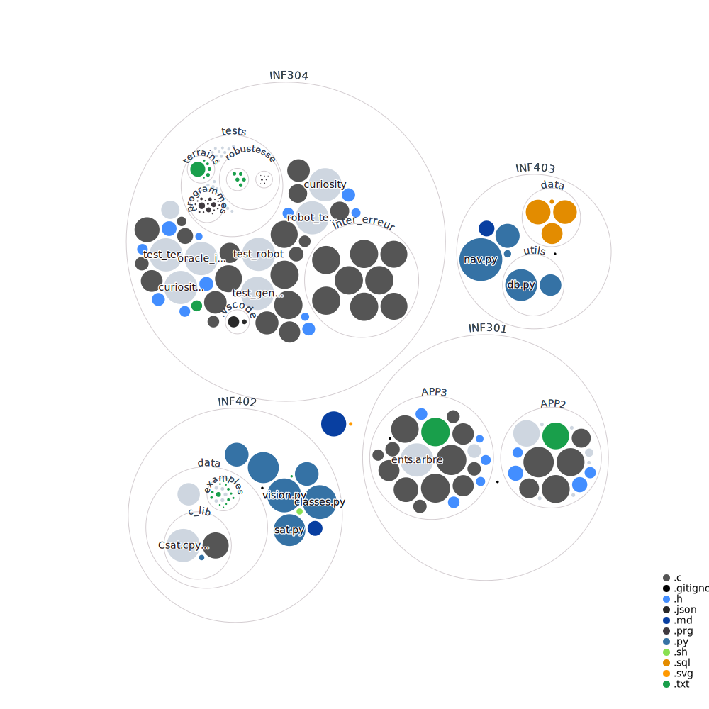

# Projets universitaires

Pour cloner une partie de ce dépôt, utilisez mon scripte [sparse-clone](https://github.com/comejv/utils-and-games/tree/main/git-sparse-clone).

Info : certains projets sont stockés dans un dépôt séparé : [utils-and-games](https://github.com/comejv/utils-and-games).

> **NB** : La plupart des projets ont été réalisés en binôme avec [Euxem](https://github.com/euxem).

***

## Graphe du dépôt

<kbd>

</kbd>

***

## INF101 

> Méthodes informatiques et techniques de programmation

[**Blackjack**](https://github.com/comejv/utils-and-games/tree/main/blackjack) : un jeu de blackjack en CLI avec des bots et des options de jeu.

***

## INF201 

> Algorithmique et programmation fonctionnelle

[**Dames**](https://github.com/comejv/utils-and-games/tree/main/dames) : un jeu de dames simple sur plateau hexagonale en CLI.

***

## INF203 

> Système et environnement de programmation

[**Cow**](https://github.com/comejv/utils-and-games/tree/main/cow) : Un programme basé sur l'application en CLI cowsay. Il vous permet d'afficher une vache avec un message personnalisé et dispose de quelques options et jeux.

***

## INF301 

> Algorithmique et programmation impérative 

- [**APP2 - Curiosity**](INF301/APP2/) : intèpreteur d'instructions pour un robot qui se déplace dans un terrain en 2D (test et génération des terrains en [INF304](INF304))
- [**APP3 - Arbre phylogénétique**](INF301/APP3/) : création, lecture et manipulation d'arbres phylogénétiques

***

## INF304 

> Bases du développement logiciel : modularisation, tests

[**INF304**](INF304/) fait suite à [INF301/APP2](INF301/APP2/) en abordant la génération de terrains et le test de l'intépreteur.

***

## INF402 

> Introduction à la logique

[**INF402 - Projet**](INF402/) : un programme qui permet de résoudre une partie du jeu "Hashiwokakero" (ou "Bridges" pour les intimes) en utilisant de la computer vision pour comprendre le plateau et de la logique pour résoudre le problème.

***

## INF403  

> Gestion de données relationnelles et applications

[**INF403 - Projet**](INF403/) : application de gestion d'une base de données pour une entreprise produisant et vendant de l'hydrogène liquide.